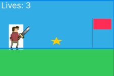

:warning: Everything between << >> needs to be replaced (remove << >> after replacing)

# Quest 
## CS110 Final Project  << One, 2024 >>

## Team Members

<< Michael DiNapoli, Will Kershaw  >>

***

## Project Description

<< It will be a 2D platformer Game. We plan to make a game similar to Mario where the character/ hero defeats enemies and dodges objects to complete the level. >>
***    

## GUI Design

### Initial Design

### Final Design

## Program Design

### Features

1. << Moveable Character >>
2. << Healthbar/ Life Counter >>
3. << power ups >>
4. << Object Collisions >>
5. << Check Point System >>
6. << Game Over Screen >>

### Classes

- << You should have a list of each of your classes with a description >>

## ATP

| Step                 |Procedure             |Expected Results                   |
|----------------------|:--------------------:|----------------------------------:|
|  1                   | Run main.py.         | GUI window appears with the title |
|                      |                      |Mario and displays the main menu.  |
|  2                   | Press Enter on the.  |Display changes to gameplay screen.|
|                      | main menu.           |                                   |
|  3                   | Use left Arrow key.  | The player moves left.            |
|  4                   | Use right Arrow key. | The player moves right.           |
|  5                   | Use the space bar.   | The player jumps.                 |
|  6                   | Close the game.      | the program ends.                 |

